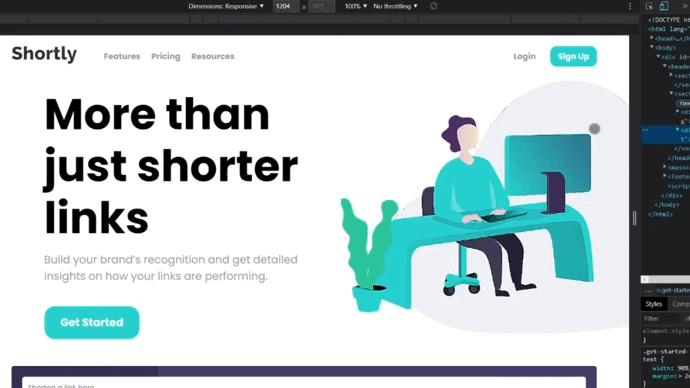

<h1 align="center">Front End Challenge - URL Shortening Page</h1>

    

    

## Used Techs:

This all project was developed using the following technologies: 

    
    
    

## About this project:

This project is a completed front-end challenge provided by <a href="https://www.frontendmentor.io/challenges">Front-end Mentor</a>, maded to train front-end skills, using HTML, Scss, Vanilla Javascript and API Fetch. This page provides business info, and the shorten links functionality.

### Functionalities:

✅<b>To Short Links: </b> provides a shorted link from a API request.

### Responsivity:

    

